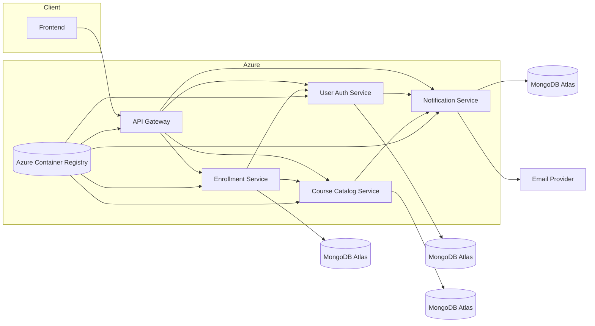

# Architecture Diagram

```mermaid
flowchart LR
  subgraph Client
    FE[Frontend]
  end

  subgraph Azure
    AGW[API Gateway]
    AUTH[User Auth Service]
    COURSE[Course Catalog Service]
    ENROLL[Enrollment Service]
    NOTIFY[Notification Service]
    ACR[(Azure Container Registry)]
  end

  FE --> AGW
  AGW --> AUTH
  AGW --> COURSE
  AGW --> ENROLL
  AGW --> NOTIFY

  ENROLL --> AUTH
  ENROLL --> COURSE
  AUTH --> NOTIFY
  COURSE --> NOTIFY

  AUTH --> MONGO1[(MongoDB Atlas)]
  COURSE --> MONGO2[(MongoDB Atlas)]
  ENROLL --> MONGO3[(MongoDB Atlas)]
  NOTIFY --> MONGO4[(MongoDB Atlas)]

  NOTIFY --> EMAIL[Email Provider]

  ACR --> AGW
  ACR --> AUTH
  ACR --> COURSE
  ACR --> ENROLL
  ACR --> NOTIFY
```
